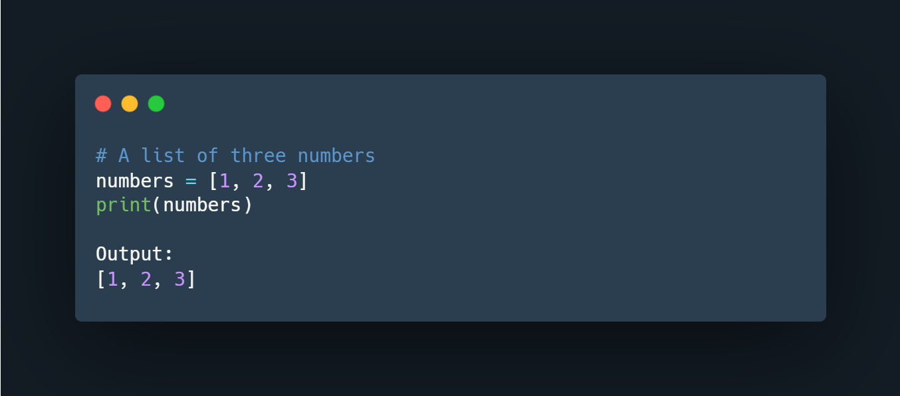

# Python-data-structures
So far, you have only stored small bits of data in a variable. This was either an integer, Boolean or a string.

But what happens if you need to work with more complex information, such as a collection of data like a list of people or a list of companies? Data structures are designed for this very purpose.

A data structure allows you to organize and arrange your data to perform operations on them. Python has the following built-in data structures: List, dictionary, tuple and set. These are all considered non-primitive data structures, meaning they are classed as objects, we will explore this more.

Along with the built-in data structures, Python allows users to create their own. Data structures such as Stacks, Queues and Trees can all be created by the user.

Each data structure can be designed to solve a particular problem or optimize a current solution to make it much more performant.

Mutability and Immutability
Data Structures can be mutable or immutable.

Mutability refers to data inside the data structure that can be modified. For example, you can either change, update, or delete the data when needed. A list is an example of a mutable data structure.

An immutable data structure will not allow modification once the data has been set. The tuple is an example of an immutable data structure.

Lists and Tuples

Content

Discussion
In Python, lists are used to store multiple data at once. For example,

Suppose we need to record the ages of 5 students. Instead of creating 5 separate variables, we can simply create a list:

Lists Elements

Create a Python List

A list is created in Python by placing items inside [], separated by commas. For example,

Here, we have created a list named numbers with 3 integer items.

A list can have any number of items and they may be of different types (integer, float, string, etc.). For example,

Access Python List Elements

In Python, each item in a list is associated with a number. The number is known as a list index.

We can access elements of an array using the index number (0, 1, 2 …). For example,

In the above example, we have created a list named languages.

List Indexing in Python

Here, we can see each list item is associated with the index number. And, we have used the index number to access the items.

Note: The list index always starts with 0. Hence, the first element of a list is present at index 0, not 1.

Slicing of a Python List
In Python, it is possible to access a section of items from the list using the slicing operator :, not just a single item. For example,

Here,

my_list[2:5] returns a list with items from index 2 to index 4.
my_list[5:] returns a list with items from index 1 to the end.
my_list[:] returns all list items

Note: When we slice lists, the start index is inclusive but the end index is exclusive.

Add Elements to a Python List

Python List provides different methods to add items to a list.

1. Using append()

The append() method adds an item at the end of the list.

For example,

Here, append() adds 32 at the end of the array.

2. Using extend()

We use the extend() method to add all items of one list to another. For example,

In the above example, we have two lists named prime_numbers and even_numbers. Notice the statement,

Change List Items
Python lists are mutable. Meaning lists are changeable. And, we can change items of a list by assigning new values using = operator. For example,

Remove an Item From a List
1. Using del()

In Python, we can use the del statement to remove one or more items from a list. For example,

2. Using remove()

We can also use the remove() method to delete a list item.

For example:

Here, languages.remove('Python') removes 'Python' from the languages list.

Python List Methods
Python has many useful list methods that make it really easy to work with lists.

Iterating through a List
We can use the for loop to iterate over the elements of a list. For example,

Python List Comprehension
List comprehension is a concise and elegant way to create lists.

A list comprehension consists of an expression followed by the for statement inside square brackets.

Here is an example to make a list with each item being increasing by power of 2.

In the above example, we have used the list comprehension to make a list with each item being increased by power of 2. Notice the code,

Tuples
A tuple in Python is similar to a list. The difference between the two is that we cannot change the elements of a tuple once it is assigned whereas we can change the elements of a list.

Creating a Tuple

A tuple is created by placing all the items (elements) inside parentheses (), separated by commas. The parentheses are optional, however, it is a good practice to use them.

A tuple can have any number of items and they may be of different types (integer, float, list, string, etc.).

Create a Python Tuple With one Element
In Python, creating a tuple with one element is a bit tricky. Having one element within parentheses is not enough.

We can use the type() function to know which class a variable or a value belongs to.

Here,

("hello") is a string so type() returns str as class of var1 i.e. <class 'str'>
("hello",) and "hello", both are tuples so type() returns tuple as class of var1 i.e. <class 'tuple'>

Access Python Tuple Elements
Like a list, each element of a tuple is represented by index numbers (0, 1, ...) where the first element is at index 0.

We use the index number to access tuple elements. For example,

1. Indexing
We can use the index operator [] to access an item in a tuple, where the index starts from 0.

So, a tuple having 6 elements will have indices from 0 to 5. Trying to access an index outside of the tuple index range( 6,7,... in this example) will raise an IndexError.

The index must be an integer, so we cannot use float or other types. This will result in TypeError.

Likewise, nested tuples are accessed using nested indexing, as shown in the example below.

In the above example,

letters[0] - accesses the first element
letters[5] - accesses the sixth element
2. Negative Indexing
Python allows negative indexing for its sequences.

The index of -1 refers to the last item, -2 to the second last item and so on. For example,

In the above example,

letters[-1] - access last element
letters[-3] - access third last element

Python Tuple Methods
In Python, methods that add items or remove items are not available with tuples. Only the following two methods are available.

Some examples of Python tuple methods:

Here,

my_tuple.count('p') - counts total number of 'p' in my_tuple
my_tuple.index('l') - returns the first occurrence of 'l' in my_tuple

More Resources:

https://www.knowledgehut.com/tutorials/python-tutorial/python-lists-tuples
https://www.freecodecamp.org/news/python-tuple-vs-list-what-is-the-difference/
https://builtin.com/software-engineering-perspectives/python-tuples-vs-lists
https://realpython.com/python-lists-tuples/

Data Structures and Algorithms in Python
Importance of Data Structures in Programming:
Data structures are fundamental components of any computer program. They provide a way to organize and store data efficiently, which is crucial for performing operations and manipulating the data effectively. Here's why they are important:

Efficient Data Organization: Data structures allow you to organize data in a way that makes it easy to access and manipulate. For example, arrays enable fast access to elements using indices, while linked lists facilitate dynamic memory allocation and insertion/deletion operations.

Optimized Operations: Different data structures are optimized for different operations. For instance, hash tables offer constant-time lookup, while trees provide efficient searching and sorting capabilities. Choosing the right data structure can significantly improve the performance of your algorithms.

Memory Management: Data structures help in efficient memory management by allocating memory only when needed and deallocating it when it's no longer required. This prevents memory wastage and improves the overall efficiency of the program.

Code Readability and Maintainability: Using appropriate data structures makes your code more readable and maintainable. It allows other developers to understand the logic behind your program easily and make modifications or enhancements without introducing bugs.

Importance of Algorithms:
Algorithms are step-by-step procedures or formulas for solving problems. They play a crucial role in computer science and programming for several reasons:

Efficiency: Algorithms determine how efficiently a task can be performed. A well-designed algorithm can significantly reduce the time and resources required to solve a problem, making your program more efficient.

Scalability: Efficient algorithms ensure that your program can handle large inputs or datasets without slowing down or crashing. This is essential for applications dealing with big data or real-time processing.

Correctness: Algorithms ensure that your program produces the correct output for any given input. By following a systematic approach to problem-solving, you can minimize errors and bugs in your code.

Reusability: Once you have implemented an algorithm, you can reuse it in different parts of your program or in other projects. This promotes code reuse and saves development time.

Building Blocks for Efficient Programming:
Linked List Implementation:
Linked lists are linear data structures where elements are stored in nodes, each containing a reference to the next node in the sequence.
They are flexible and efficient for insertion and deletion operations, especially in scenarios where the size of the data structure is dynamic.
Implementing a linked list involves creating a Node class with attributes for data and a reference to the next node, and a LinkedList class with methods for insertion, deletion, traversal, etc.
Sorting Algorithms Visualization:
Sorting algorithms arrange elements in a specific order, such as numerical or lexicographical order.
Visualization techniques, such as animations or step-by-step illustrations, help understand how sorting algorithms work and how they compare in terms of efficiency and performance.
Common sorting algorithms include Bubble Sort, Selection Sort, Insertion Sort, Merge Sort, Quick Sort, and Heap Sort.
Graph Traversal and Shortest Path:
Graph traversal algorithms are used to visit and process all the nodes in a graph.
Shortest path algorithms find the shortest path between two nodes in a graph, which is essential in network routing, GPS navigation, and various optimization problems.
Examples of traversal algorithms include Depth-First Search (DFS) and Breadth-First Search (BFS), while Dijkstra's algorithm and Bellman-Ford algorithm are commonly used for finding shortest paths.
Binary Search Tree (BST) Operations:
Binary Search Trees are hierarchical data structures composed of nodes, where each node has at most two children: a left child and a right child.

BST operations include insertion, deletion, and searching for elements in the tree.

These operations are efficient because BSTs maintain a sorted order of elements, allowing for fast retrieval and manipulation.

//In computer science, particularly in the context of data structures like linked lists, trees, and graphs, a "node" is a basic unit of storage. It's typically used to store data and a reference (or references) to other nodes.
Here's a breakdown of what a node generally consists of:

Data: This is the actual information being stored within the node. It could be a single piece of data, such as an integer, string, or any other data type, or it could be a collection of data.

References/Pointers: These are pointers or references that point to other nodes in the data structure. In a singly linked list, for example, a node typically contains a single reference pointing to the next node in the sequence. In a binary tree, a node may contain references to its left and right child nodes.

Nodes serve as building blocks for constructing more complex data structures. They allow data to be organized in a way that facilitates efficient storage, retrieval, and manipulation. Each node holds a piece of data and connects to other nodes, forming the structure of the data storage system.//

Understanding these building blocks and mastering their implementation in Python will empower you to write efficient and scalable programs for a wide range of applications.